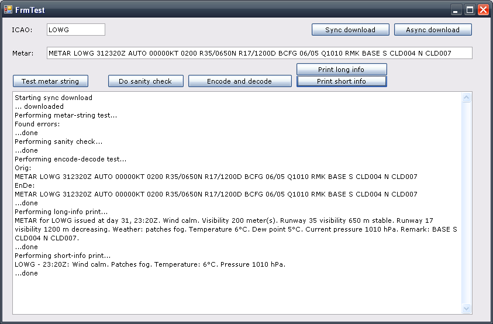

METAR.NET is class library for *.NET FW 3.5* used to decode and encode weather information METAR, TAF or SPECI reports used to capture and present weather mostly for aviation.
There has been recently added implementation for *Silverlight 3*, you will find it in the downloads section.

For Java implementation see https://github.com/Engin1980/MetarJ 

*EDIT --- Version 2.0 RC2 (29. 6. 2011) ! ! ! * New version of METAR.NET decoder now supports METAR, SPECI and TAF reports. However, this version is completely rewritten and is fully incompatible with the previous 1.* versions. There are new namespaces, new data type names, e.t.c. The content is now divided into multiple dll files - one with main data types, another supporting downloading, decoding and formattings of the decoded metar/speci/taf reports. However, new specification of METAR reports including NIL, AMD, COR, NCD,... codes is supported.

Remark: *If you test this projekt and find metar, which causes error during analysis, please report this METAR string as in commens - very appreciated!*

It consists of several parts.

First part is library able to *decode and encode METAR/TAF/SPECI string*, e.g. METAR LKPR 20202Z VRB03KT ... *into the set of (instances of) classes* like Wind, Visibility, etc. describing weather; and back, after changes, to create metar string from value captured in those set.

Second part is small project supporting ability *to download METAR information* (that is, METAR string) *from on-line web source*. There are many sources on the web; the project only introduces two opinions, but by interface it is open for any extensions.

Another part supports formating of decoded report into human readable format - like "Today wind is ...". This part supports only EN-us and partially CZ-cs cultures, but you can translate your own.

Last part is demonstration. Testing solution is included (only in _NET release, not Silverlight), with example source codes how to use the library to encode/decode metar.



Program was designed originally for EU metar stations (that is, visibility in meters, pressure in QNH, etc., but now supports also main US standards and some more differences.
A help created from documentation (XML comments) is included.

*Examples of library functionality*

Input metar string (example, not real):
METAR EETN 012150Z 26004G18KT 6000NE 0300S R04/0300V0500D R22/2000 +SNBR -RAHZ SCT002 OVC012 04/04 Q1013 WS ALL RWY R08/000095 R26/CLDR// TEMPO AT1300 2000 BR SKC RMK OA2

Decoded and again encoded string into metar (should be the same):
METAR EETN 012150Z 26004G18KT 6000NE 0300S R04/0300V0500D R22/2000 +SNBR -RAHZ SCT002 OVC012 04/04 Q1013 WS ALL RWY R08/000095 R26/CLDR// TEMPO AT1300 2000 BR SKC RMK OA2

Create short information string:
EETN - 21:50Z: Wind N at 18 KT. Heavy snow mist, light rain haze. Temperature: 4°C. Pressure 1013 hPa.

Created long information string:
METAR for EETN issued at day 1, 21:50Z. Wind 260 at 4KT gusting to 18KT. Visibility 6000 meters (NE). Runway 04 visibility 300 to 500 m decreasing. Runway 22 visibility 2000 m. Weather: heavy snow mist; light rain haze. Clouds: 200 ft scattered; 1200 ft overcast. Temperature 4°C. Dew point 4°C. Current pressure 1013 hPa. Windshear reported at all runways. Runway 08 is covered by 0mm of clean dry runway over N/A, braking action good. Runway 26 is cleared. Weather trend temporally at 13:00Z : Visibility 2000 meters. Weather: mist. Sky clear. Remark: OA2.

Created translated (czech) information string:
METAR pro EETN vydán dne 1, 21:50Z. Vítr 260 o rychlosti 4kt v nárazech až 18kt. Viditelnost 6000 metrů (SV). Runway 04 viditelnost 300 to 500 m klesající. Runway 22 viditelnost 2000 m. Počasí: silný sníh mlha; slabý déšť kouřmo. Oblačnost: 200 ft polojasno; 1200 ft zataženo. Teplota 4°C. Rosný bod 4°C. Tlak 1013 hPa. Střih větru na všech ravnejích. Ravnej 08 je pokrytá 0mm z čistá suchá ranvej na N/A, brzdný účinek dobrý. Ravnej 26 je očištěna/y. Trend počasí občasně at 13:00Z : Viditelnost 2000 metrů. Počasí: mlha. Bez oblačnosti. Poznámky: OA2.

Real life metar example:
METAR LKPR 211530Z 31019KT 9999 FEW030 07/01 Q1013 NOSIG RMK REG QNH 1009=

En/decoded:
METAR LKPR 211530Z 31019KT 9999 FEW030 07/01 Q1013 NOSIG RMK REG QNH 1009=

Long info:
METAR for LKPR issued at day 21, 15:30Z. Wind 310 at 19KT. Visibility 9999 meters. Clouds: 3000 ft few. Temperature 7°C. Dew point 1°C. Current pressure 1013 hPa. No significant change expected. Remark: REG QNH 1009=.

ÄŒesky:
METAR pro LKPR vydán dne 21, 15:30Z. Vítr 310 o rychlosti 19kt. Viditelnost 9999 metrů. Oblačnost: 3000 ft skoro jasno. Teplota 7°C. Rosný bod 1°C. Tlak 1013 hPa. Trend počasí: žádné význačné změny. Poznámky: REG QNH 1009=.

Short info:
LKPR - 15:30Z: Wind N at 19 KT. Temperature: 7°C. Pressure 1013 hPa.

*Example how decoded classes looks like in XML*

```
<METAR&nbsp;type="Metar">
<METAR    type="Metar">
        <Type    type="eType">METAR</Type>
        <ICAO    type="String">EETN</ICAO>
        <Date    type="DayTime">
                <Day    type="Int32">1</Day>
                <Hour    type="Int32">21</Hour>
                <Minute    type="Int32">50</Minute>
        </Date>
        <IsAUTO    type="Boolean">False</IsAUTO>
        <Wind    type="Wind">
                <Unit    type="eUnit">KT</Unit>
                <Direction    type="Int32">260</Direction>
                <IsVariable    type="Boolean">False</IsVariable>
                <Speed    type="NonNegInt">4</Speed>
                <GustSpeed    type="NonNegInt">18</GustSpeed>
                <Variability    type="WindVariable">(null)</Variability>
                <IsVarying    type="Boolean">False</IsVarying>
                <IsCalm    type="Boolean">False</IsCalm>
        </Wind>
        <Visibility    type="Visibility">
                <DirectionSpecification    type="eDirection">NE</DirectionSpecification>
                <OtherDistance    type="Racional">300/1</OtherDistance>
                <OtherDirectionSpecification    type="eDirection">S</OtherDirectionSpecification>
                <Runways    type="List`1">
                        <Item    type="RunwayVisibility">
                                <DeviceMeasurementRestriction    type="Nullable`1">(null)</DeviceMeasurementRestriction>
                        </Item>
                        <Item    type="RunwayVisibility">
                                <DeviceMeasurementRestriction    type="Nullable`1">(null)</DeviceMeasurementRestriction>
                                <Tendency    type="Nullable`1">(null)</Tendency>
                                <VariableVisibility    type="Nullable`1">(null)</VariableVisibility>
                        </Item>
                </Runways>
                <UseEUStyle    type="Boolean">True</UseEUStyle>
                <IsDevicesMinimumValue    type="Boolean">False</IsDevicesMinimumValue>
                <IsClear    type="Boolean">False</IsClear>
                <Distance    type="Racional">6000/1</Distance>
        </Visibility>
        <Phenomens    type="PhenomInfo">
                <Item    type="ePhenomCollection">
                        <Item    type="ePhenom">Heavy</Item>
                        <Item    type="ePhenom">SN</Item>
                        <Item    type="ePhenom">BR</Item>
                </Item>
                <Item    type="ePhenomCollection">
                        <Item    type="ePhenom">Light</Item>
                        <Item    type="ePhenom">RA</Item>
                        <Item    type="ePhenom">HZ</Item>
                </Item>
        </Phenomens>
        <Clouds    type="CloudInfo">
                <Item    type="Cloud">
                        <IsCB    type="Boolean">False</IsCB>
                        <IsTCU    type="Boolean">False</IsTCU>
                        <Altitude    type="NonNegInt">2</Altitude>
                        <Type    type="eType">SCT</Type>
                </Item>
                <Item    type="Cloud">
                        <IsCB    type="Boolean">False</IsCB>
                        <IsTCU    type="Boolean">False</IsTCU>
                        <Altitude    type="NonNegInt">12</Altitude>
                        <Type    type="eType">OVC</Type>
                </Item>
        </Clouds>
        <Temperature    type="Int32">4</Temperature>
        <DewPoint    type="Int32">4</DewPoint>
        <Pressure    type="PressureInfo">
                <Unit    type="eUnit">hPa</Unit>
                <Value    type="Double">1013</Value>
                <QNH    type="Int32">1013</QNH>
                <mmHq    type="Double">29,9173065564087</mmHq>
        </Pressure>
        <RePhenomens    type="PhenomInfo">(null)</RePhenomens>
        <WindShears    type="WindShearInfo">
        </WindShears>
        <RunwayConditions    type="RunwayConditionInfo">
                <Item    type="RunwayCondition">
                        <IsCleared    type="Boolean">False</IsCleared>
                        <Runway    type="String">08</Runway>
                        <IsForAllRunways    type="Boolean">False</IsForAllRunways>
                        <IsObsolete    type="Boolean">False</IsObsolete>
                        <Deposit    type="eDeposit">CleanDry</Deposit>
                        <Contamination    type="eContamination">Reserved0</Contamination>
                        <Depth    type="eDepth">lessThan1mm</Depth>
                        <Friction    type="eFriction">BrakingActionGood</Friction>
                </Item>
                <Item    type="RunwayCondition">
                        <IsCleared    type="Boolean">True</IsCleared>
                        <Runway    type="String">26</Runway>
                        <IsForAllRunways    type="Boolean">False</IsForAllRunways>
                        <IsObsolete    type="Boolean">False</IsObsolete>
                        <Deposit    type="Nullable`1">(null)</Deposit>
                        <Contamination    type="Nullable`1">(null)</Contamination>
                        <Depth    type="Nullable`1">(null)</Depth>
                        <Friction    type="Nullable`1">(null)</Friction>
                </Item>
        </RunwayConditions>
        <Trend    type="TrendInfo">
                <Type    type="eType">TEMPO</Type>
                <Times    type="TrendTimeInfo">
                        <Item    type="TrendTime">
                        </Item>
                </Times>
                <Wind    type="Wind">(null)</Wind>
                <Visibility    type="TrendVisibility">
                        <UseEUStyle    type="Boolean">True</UseEUStyle>
                        <IsDevicesMinimumValue    type="Boolean">False</IsDevicesMinimumValue>
                        <IsClear    type="Boolean">False</IsClear>
                        <Distance    type="Racional">2000/1</Distance>
                </Visibility>
                <Phenomens    type="PhenomInfo">
                        <Item    type="ePhenomCollection">
                        </Item>
                </Phenomens>
                <Clouds    type="CloudInfo">(null)</Clouds>
        </Trend>
        <Remark    type="String">OA2</Remark>
        <Humidity    type="Double">100</Humidity>
</METAR>
```
